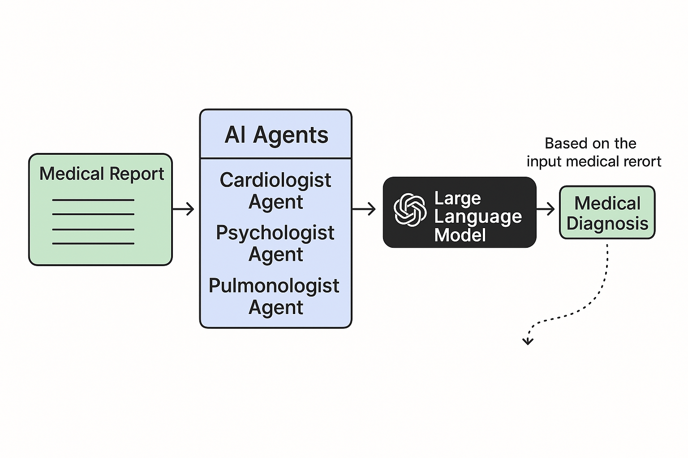

# AI Agents for Medical Diagnosis



A comprehensive Python system designed to create specialized LLM-based AI agents that analyze complex medical cases. The system integrates insights from various medical specialists to provide thorough assessments and personalized treatment recommendations, demonstrating the potential of AI in multidisciplinary medicine.

## Features

- **Multiple Specialist AI Agents**: Three specialized agents (Cardiologist, Psychologist, Pulmonologist) analyze medical reports from their respective perspectives
- **Parallel Processing**: Utilizes threading for efficient concurrent analysis
- **Multidisciplinary Integration**: Combines specialist opinions for comprehensive diagnoses
- **PDF Report Generation**: Creates professional medical reports with proper formatting and styling
- **Support for Markdown**: Properly renders emphasis, bullet points, and other formatting in reports
- **Interactive Interface**: Easy-to-use command-line interface for selecting medical reports
- **Extensible Architecture**: Designed to easily add more specialist agents in the future

## Current Version Overview

In the current version, we have implemented three AI agents using GPT-4o, each specializing in a different aspect of medical analysis. A medical report is passed to each of these agents, who then analyze the report simultaneously using threading, based on their specific area of expertise. Each agent provides recommendations and diagnoses from their perspective. After all AI agents complete their analyses, the results are combined and passed to a large language model, which summarizes the findings and identifies three potential health issues for the patient. The system then generates both a text summary and a professionally formatted PDF report.

## How to Run on Your Local Machine

### Prerequisites
- Python 3.9 or higher
- Conda (recommended for environment management)
- An OpenAI API key with access to GPT-4o

### Setup Instructions

1. **Clone the repository**
   ```bash
   git clone https://github.com/yourusername/AI-Agents-for-Medical-Diagnosis.git
   cd AI-Agents-for-Medical-Diagnosis
   ```

2. **Create and activate a conda environment**
   ```bash
   conda create -n medical-agents python=3.9
   conda activate medical-agents
   ```

3. **Install dependencies**
   ```bash
   pip install -r requirements.txt
   ```

4. **Configure your OpenAI API key**
   - Create an `apikey.env` file in the root directory
   - Add your API key in the following format:
     ```
     OPENAI_API_KEY=your_api_key_here
     ```

5. **Run the application**
   ```bash
   python main.py  # Note the lowercase 'm'
   ```

6. **Select a medical report to analyze**
   - The application will display a list of available medical reports
   - Enter the number corresponding to the report you want to analyze
   - The system will run all specialist agents and combine their analyses
   - The results will be saved to:
     - `Results/final_diagnosis.txt`: Text summary of the diagnosis
     - `Results/[Condition]_Report_[Timestamp].pdf`: Formatted PDF report

### Running Tests

To test the system with a predefined medical report:

```bash
python test_diagnosis.py
```

This will analyze the Rheumatoid Arthritis sample report and generate both text and PDF outputs, which is useful for development and verification.

### Example Output

After running the application, the system will:

1. Process the selected medical report through all specialist agents
2. Generate a comprehensive diagnosis with potential health issues
3. Create a formatted PDF report with proper styling and formatting
4. Display a summary of the diagnosis in the terminal

## AI Agents

**1. Cardiologist Agent**

- **Focus**: Identify any potential cardiac issues that could explain the patient's symptoms, including ruling out conditions such as arrhythmias or structural abnormalities that might not be apparent in initial evaluations.
  
- **Recommendation**: Suggest additional cardiovascular testing or continuous monitoring if necessary to uncover hidden heart-related problems. Provide management strategies if a cardiovascular issue is identified.

**2. Psychologist Agent**

- **Focus**: Determine if the symptoms align with a psychological condition, such as panic disorder or another anxiety-related issue. Assess the impact of stress, anxiety, and lifestyle factors on the patient's overall condition.
  
- **Recommendation**: Recommend appropriate psychological interventions (e.g., therapy, stress management techniques) or medications to address the psychological aspects of the symptoms. Evaluate whether adjustments to the current psychological management are needed.

**3. Pulmonologist Agent**

- **Focus**: Assess whether symptoms like shortness of breath and dizziness are due to a respiratory condition, such as asthma or a breathing disorder, that could mimic cardiac symptoms.
  
- **Recommendation**: Suggest additional respiratory evaluations, such as lung function tests or exercise-induced bronchoconstriction tests, to rule out any underlying lung conditions. Recommend breathing exercises or other treatments if a respiratory issue is suspected.

**4. Multidisciplinary Team Agent**

- **Focus**: Integrate and synthesize the findings from all specialist agents to create a comprehensive diagnosis.

- **Output**: Produces a final diagnosis highlighting the most likely health issues with supporting evidence, considering all specialist perspectives.

## Repository Structure

- **Medical Reports/**: Contains various synthetic medical reports covering different conditions
- **Utils/**: Contains the AI agent implementations and helper functions
- **Results/**: Stores the outputs of the agentic system (text files and PDF reports)
- **templates/**: Contains HTML templates and styling for PDF report generation
  - **base_report.html**: Main template for PDF report structure
  - **clinical_style.css**: Styling for the PDF reports
  - **pdf_utils.py**: Utilities for PDF generation with WeasyPrint

## System Requirements

- **Python**: 3.9 or higher
- **Operating System**: Cross-platform (Windows, macOS, Linux)
- **RAM**: 4GB minimum (8GB+ recommended)
- **Storage**: At least 500MB free space
- **Internet Connection**: Required (for OpenAI API access)

## Required Packages

Key dependencies include:
- **openai**: For AI agent processing
- **python-dotenv**: For environment variable management
- **weasyprint**: For PDF generation
- **jinja2**: For HTML templating
- **concurrent.futures**: For parallel processing (part of Python standard library)

Full dependencies are listed in the `requirements.txt` file.

## Troubleshooting

- **API Errors**: Verify that your OpenAI API key is correct and has sufficient quota
- **File Not Found Errors**: Check file paths and ensure the Medical Reports directory contains the expected files
- **PDF Generation Errors**: Make sure WeasyPrint is properly installed with all system dependencies
- **Package Conflicts**: Try creating a fresh conda environment and reinstalling the dependencies
- **Unicode Errors**: Ensure all text files use UTF-8 encoding

## Future Enhancements

In future versions, the system could expand to include:
- **Additional Specialist Agents**: Incorporate agents specializing in fields like neurology, endocrinology, and immunology
- **Enhanced AI Integration**: Implement agents using the [Assistant API from OpenAI](https://platform.openai.com/docs/assistants/overview) with function calling and code interpreter capabilities
- **Advanced Report Parsing**: Improved methodologies to handle medical reports with more complex structures
- **Interactive Web Interface**: A user-friendly web application for easier report selection and result visualization
- **Historical Analysis**: Compare current diagnoses with previous ones for returning patients
- **Treatment Recommendations**: More detailed treatment plans based on the diagnosis
